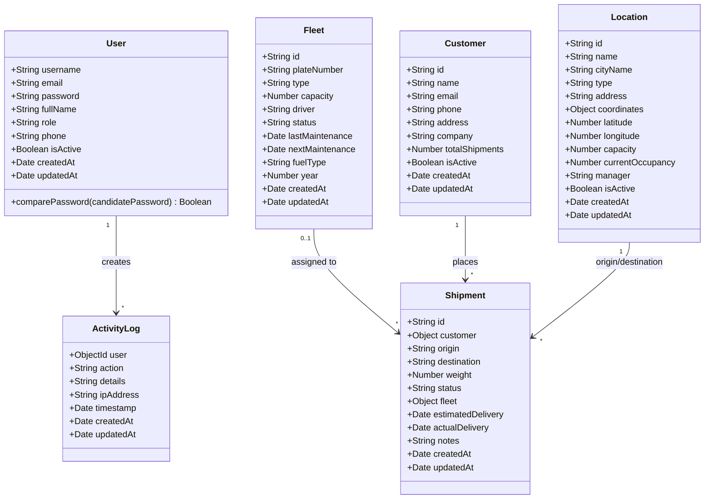
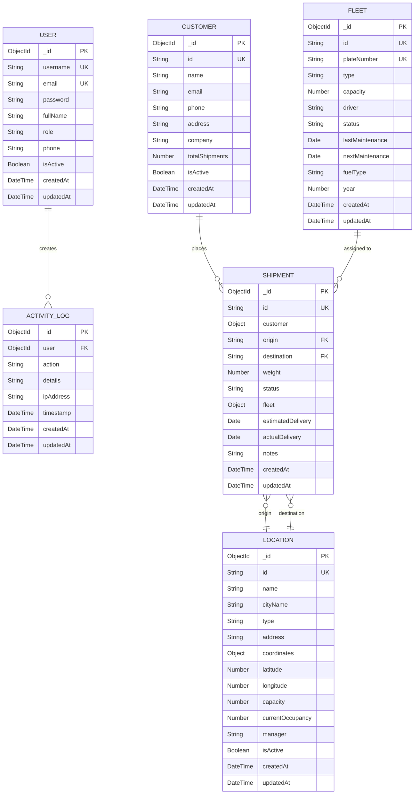
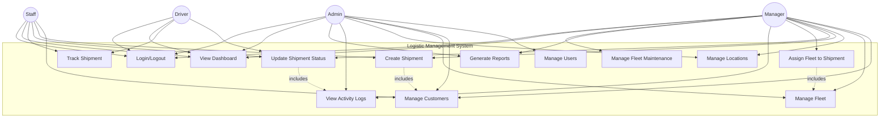
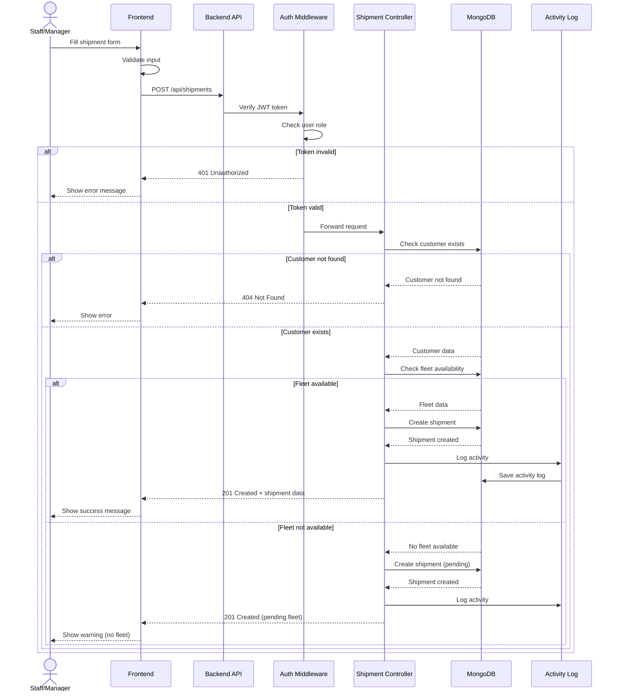
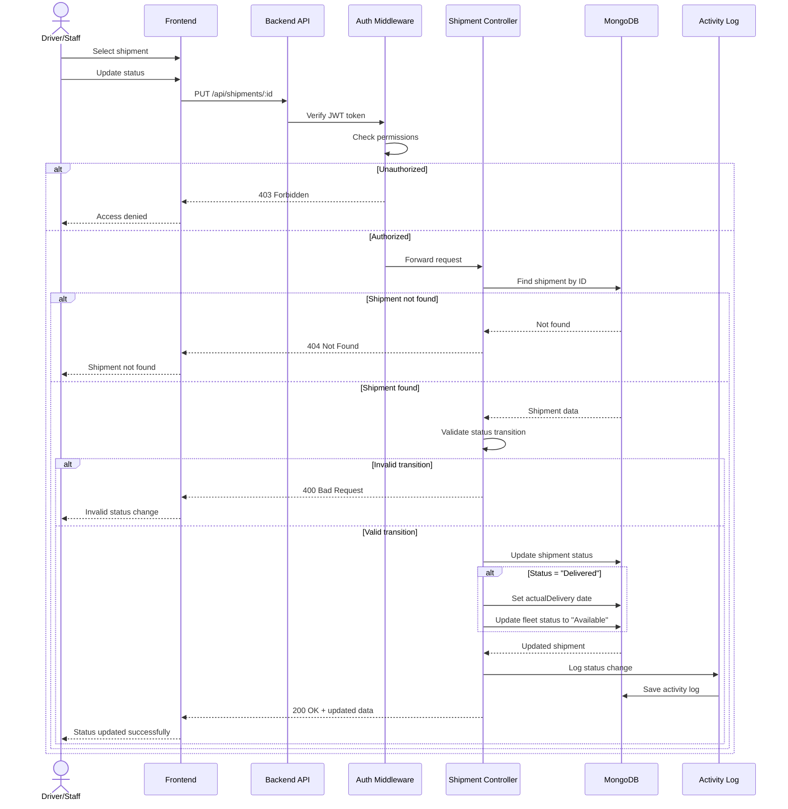
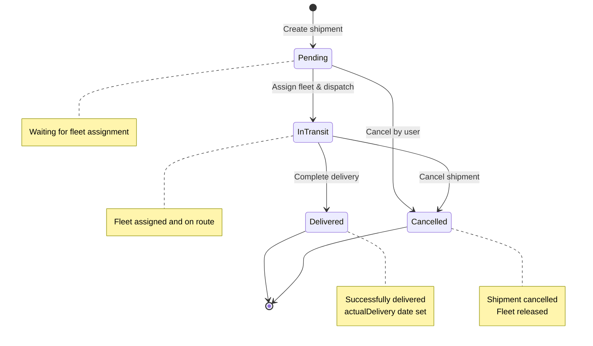
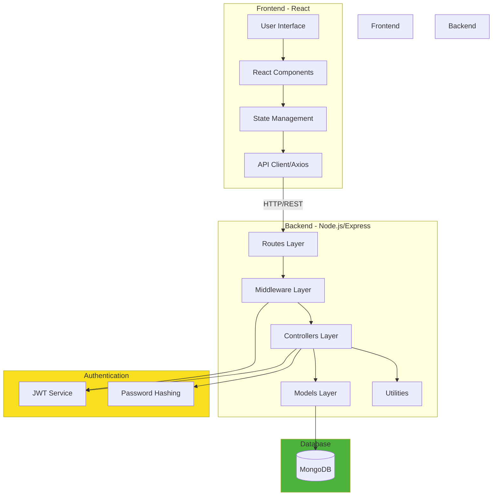
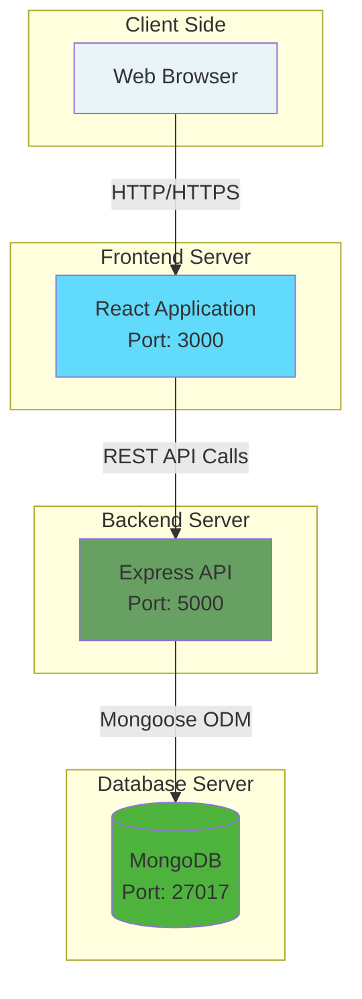
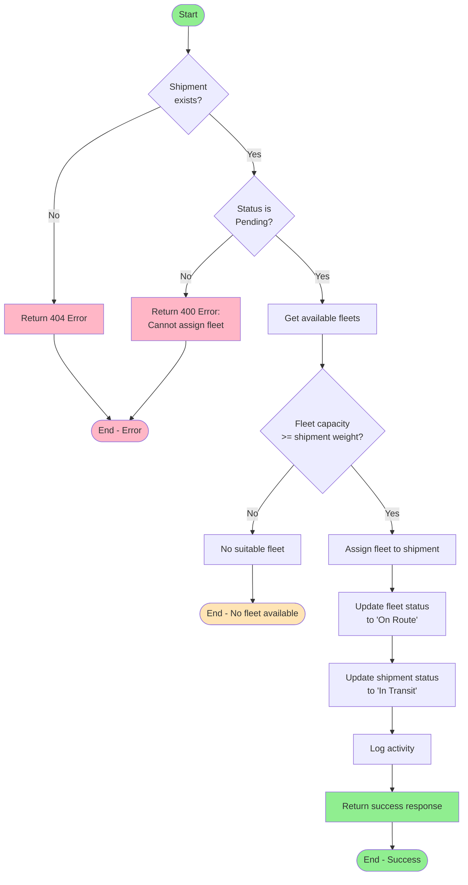

# UML Diagrams - Sistem Logistik

## 1. Class Diagram

Diagram ini menunjukkan struktur model/entitas dalam sistem beserta atribut dan method-nya.

## 2. Entity Relationship Diagram (ERD)

Diagram ini menunjukkan relasi antar entitas dalam database.

## 3. Use Case Diagram

Diagram ini menunjukkan interaksi berbagai role user dengan sistem.

## 4. Sequence Diagram - Create Shipment Flow

Diagram ini menunjukkan alur proses pembuatan shipment baru.

## 5. Sequence Diagram - Update Shipment Status Flow

Diagram ini menunjukkan alur proses update status shipment.

## 6. State Diagram - Shipment Status

Diagram ini menunjukkan state transitions untuk status shipment.

## 7. Component Diagram - System Architecture

Diagram ini menunjukkan arsitektur komponen sistem.

## 8. Deployment Diagram

Diagram ini menunjukkan deployment architecture sistem.

## 9. Activity Diagram - Fleet Assignment Process

Diagram ini menunjukkan proses assignment fleet ke shipment.

---

## Cara Menggunakan Diagram Ini

1. **Untuk melihat diagram**: Buka file ini di editor yang support Mermaid (VS Code dengan extension Mermaid, GitHub, GitLab, dll)
2. **Untuk export**: Gunakan tools seperti:
   - Mermaid Live Editor: https://mermaid.live/
   - VS Code extension: Markdown Preview Mermaid Support
   - CLI: `mmdc -i uml-diagrams.md -o output.pdf`

## Legend

- **PK**: Primary Key
- **FK**: Foreign Key
- **UK**: Unique Key
- **||--o{**: One to Many relationship
- **}o--||**: Many to One relationship
- **-->**: Association/Dependency
- **-.includes.->**: Include relationship
