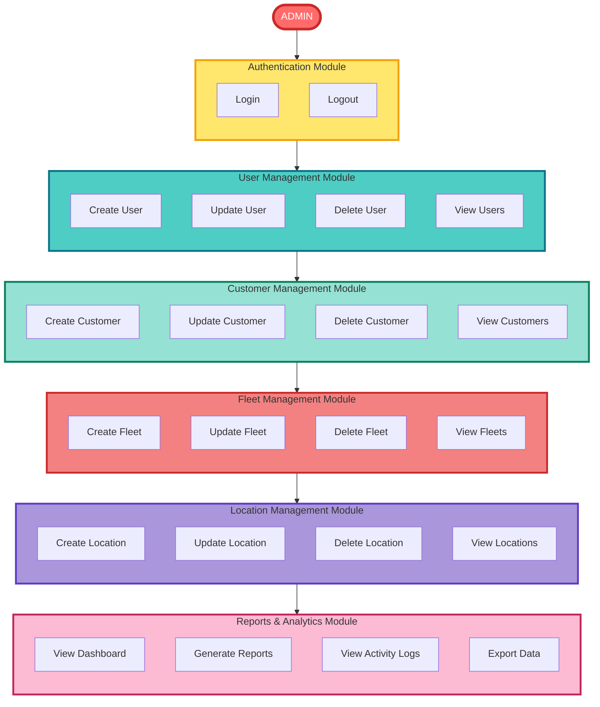
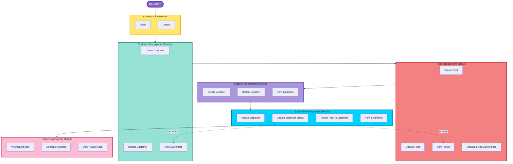
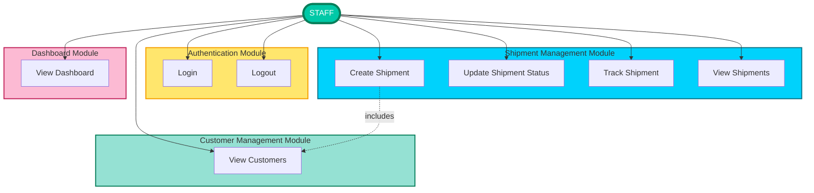
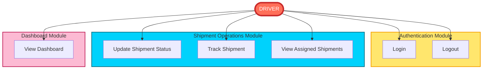
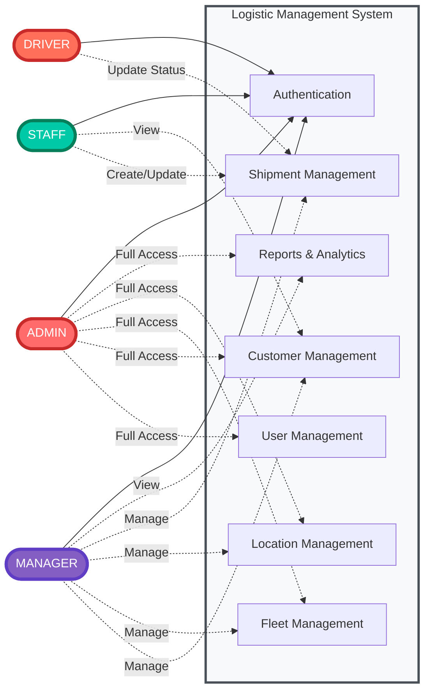

# UML Diagrams - Sistem Logistik

## 3. Use Case Diagrams

Diagram ini menunjukkan interaksi berbagai role user dengan sistem. Untuk kemudahan pembacaan, diagram dipisah berdasarkan role.

### 3.1 Use Case Diagram - Admin Role

### 3.2 Use Case Diagram - Manager Role

### 3.3 Use Case Diagram - Staff Role

### 3.4 Use Case Diagram - Driver Role

### 3.5 Use Case Diagram - System Overview (All Roles)

